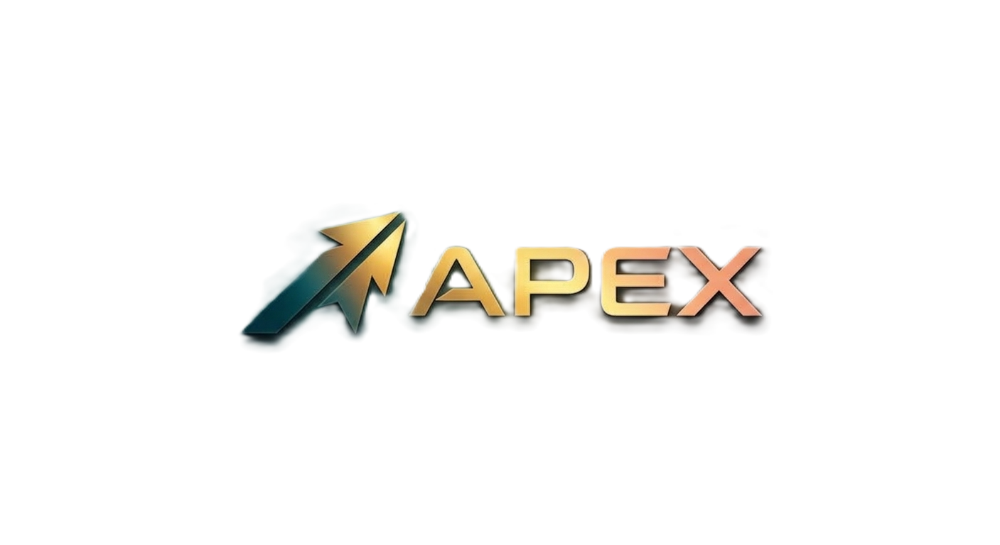

<div align="center">



# APEX — THE WEBSITE IS THE DRIVE

### An Interactive Automotive Kinetics Experience

*Precision Technical Brutalism × Aerodynamic Minimalism*

---

[](https://react.dev)
[](https://vitejs.dev)
[](https://tailwindcss.com)
[](https://greensock.com/gsap/)
[](https://www.khronos.org/webgl/)
[](https://developer.mozilla.org/en-US/docs/Web/JavaScript)
[](https://github.com/studio-freight/lenis)
[](https://postcss.org/)

<br />

[](https://pranav-6944.github.io/Apex/)
[](https://github.com/pranav-6944/Apex/actions)

</div>

---

## ⚡ Overview

**APEX** is not a website about a car. It *is* the car.

Every scroll is throttle. Every pixel is engineered to tolerance. This is an immersive, production-grade interactive automotive experience built with raw web technology — no templates, no UI kits, no compromise.

> **1,200 HP · 0–100 km/h in 3.2 s · 16,000 RPM · 99 Chassis Globally Allocated**

---

## 🎯 Experience Sections

| # | Section | Interaction |
|---|---------|-------------|
| `00` | **IGNITION** | Cold-boot system, tactile ignition core, laser shoot sequence |
| `01` | **AERODYNAMICS FIRST** | 4-phase deconstruction + live WebGL aerodynamic streamline shader |
| `02` | **FIND YOUR LIMIT** | Scroll-velocity typography stretch, kinetic amber gradient clip |
| `03` | **COCKPIT MODE** | Live G-force accelerometer, 16,000 RPM dial, tactile gear selectors |
| `04` | **ACCELERATION LAB** | 0→100 km/h launch counter, simulated torque discharge pedal |
| `05` | **MATERIAL LAB** | 4 structural strata — carbon fiber, 900V battery, axial-flux motors |
| `06` | **THE APEX CODE** | GSAP sticky card stacking — Control · Precision · Intelligence |
| `07` | **LOOK CLOSER** | Cursor-following X-ray photon scanner with chassis telemetry pods |
| `08` | **CHOOSE YOUR MACHINE** | 2024–2027 engineering track, 3 vehicle archetypes |
| `09` | **ONE CONTINUOUS ROAD** | St. Gotthard Alpine expedition + acoustic waveform visualizer |
| `10` | **RESERVE** | Final CTA — 99 chassis, global allocation |

---

## 🛠️ Tech Stack

### Core

| Technology | Purpose |
|------------|---------|
|  | Component architecture & state |
|  | Lightning-fast build tooling & HMR |
|  | Design token system — zero utility duplication |

### Animation & Motion

| Technology | Purpose |
|------------|---------|
|  | Sticky pinning, timeline orchestration, card stacking |
|  | Buttery smooth scroll engine synced to GSAP RAF |
| **Custom WebGL** | Procedural aerodynamic streamlines with simplex noise flow fields |

### Design System

| Token | Value |
|-------|-------|
| `graphite-deep` | `#060708` — primary background |
| `graphite` | `#0b0c0e` — card surface |
| `titanium` | `#eceae5` — primary text |
| `amber.apex` | `#f59e0b` — electric accent |
| Fonts | Space Grotesk · Syne · JetBrains Mono · Chivo |
| Roundedness | **Zero radius** — 45° chamfers throughout |

---

## 🚀 Getting Started

```bash
# Clone the repository
git clone https://github.com/pranav-6944/Apex.git
cd Apex

# Install dependencies
npm install

# Start development server
npm run dev
```

Open http://localhost:5173 and **press IGNITION**.

```bash
# Production build
npm run build

# Preview production build
npm run preview
```

---

## 📁 Project Structure

```
Apex/
├── public/
│   ├── Apex-logo.png               # Brand logo
│   ├── favicon.ico                 # Browser favicon
│   ├── favicon-32x32.png
│   ├── favicon-16x16.png
│   ├── apple-touch-icon.png
│   └── site.webmanifest
├── src/
│   ├── components/
│   │   ├── CursorSystem.jsx              # Dual-element physics cursor
│   │   ├── HeaderHUD.jsx                 # Fixed telemetry navigation bar
│   │   ├── AerodynamicStreamlinesShader.jsx  # WebGL wind-tunnel renderer
│   │   ├── GForceMeter.jsx               # Live 2D accelerometer cluster
│   │   └── AcousticWaveform.jsx          # Harmonic frequency visualizer
│   ├── sections/
│   │   ├── IgnitionSection.jsx           # Cold boot → ignition sequence
│   │   ├── AssemblySection.jsx           # Aerodynamics deconstruction
│   │   ├── VelocityHeroSection.jsx       # Kinetic scroll typographics
│   │   ├── CockpitSection.jsx            # Telemetry dashboard cluster
│   │   ├── AccelerationLabSection.jsx    # 0→100 launch simulator
│   │   ├── MaterialLabSection.jsx        # Structural strata cards
│   │   ├── ApexCodeSection.jsx           # GSAP sticky card stack
│   │   ├── ScannerSection.jsx            # X-ray photon scanner
│   │   ├── ModelsSection.jsx             # Vehicle archetype selector
│   │   ├── DriveJourneySection.jsx       # Alpine expedition canvas
│   │   └── ReserveSection.jsx            # Reserve chassis CTA
│   ├── hooks/
│   │   ├── useScrollVelocity.js          # Real-time km/h from scroll delta
│   │   ├── useMagnetic.js                # Physics-based cursor magnetism
│   │   └── useMediaQuery.js              # Responsive + motion preference
│   ├── App.jsx                           # Lenis + GSAP orchestration
│   ├── main.jsx                          # Entry point
│   └── index.css                         # Global tokens, keyframes, scrollbar
├── index.html
├── tailwind.config.js                    # 1:1 design token mapping
├── vite.config.js
└── package.json
```

---

## 🎨 Design Philosophy

> *"The website must feel like the car — not a page about the car."*

**Precision Technical Brutalism** — Hard geometry. Zero decorative radius. Honest materials. Every element earns its place on screen through function, not decoration.

**Aerodynamic Minimalism** — Information flows like airflow across a body. Typography compresses under velocity. Grids anchor to chassis coordinates. Amber highlights live data.

---

## 🏎️ Vehicle Specifications

```
APEX HYPERCAR — CHASSIS 001
━━━━━━━━━━━━━━━━━━━━━━━━━━━━━━━━━━━
Power Output      1,200 HP
Torque            1,240 Nm
0 → 100 km/h      3.2 s
Top Speed         348 km/h
Drag Coefficient  0.21 Cd
Battery           900V Architecture
Motors            Dual Axial-Flux
Chassis           Carbon Fiber Monocoque
Allocation        99 Units Globally
━━━━━━━━━━━━━━━━━━━━━━━━━━━━━━━━━━━
```

---

## 📜 License

MIT © APEX Automotive Kinetics

---

<div align="center">

**Built with surgical precision. Not for the faint of foot.**

[](https://github.com/pranav-6944/Apex)

</div>
